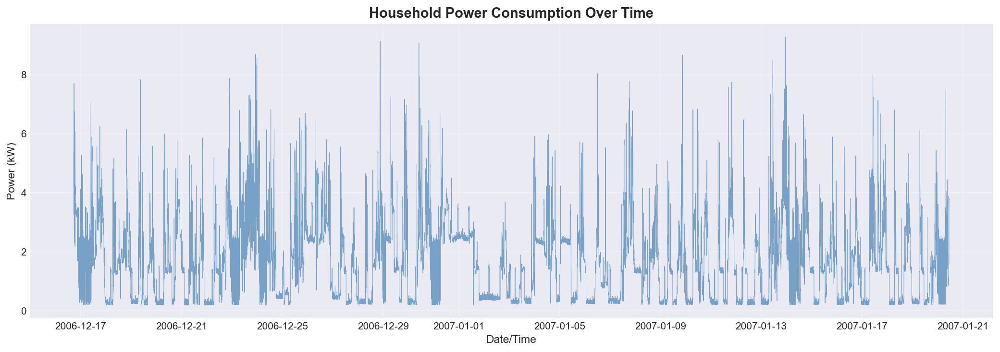
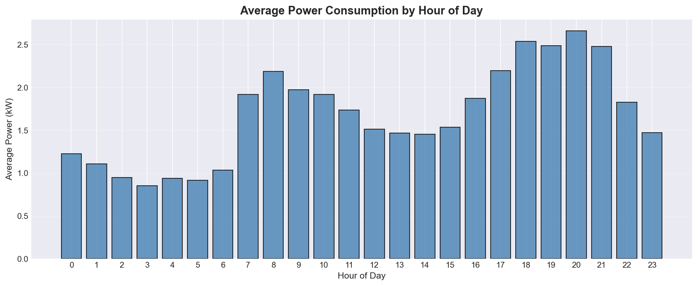
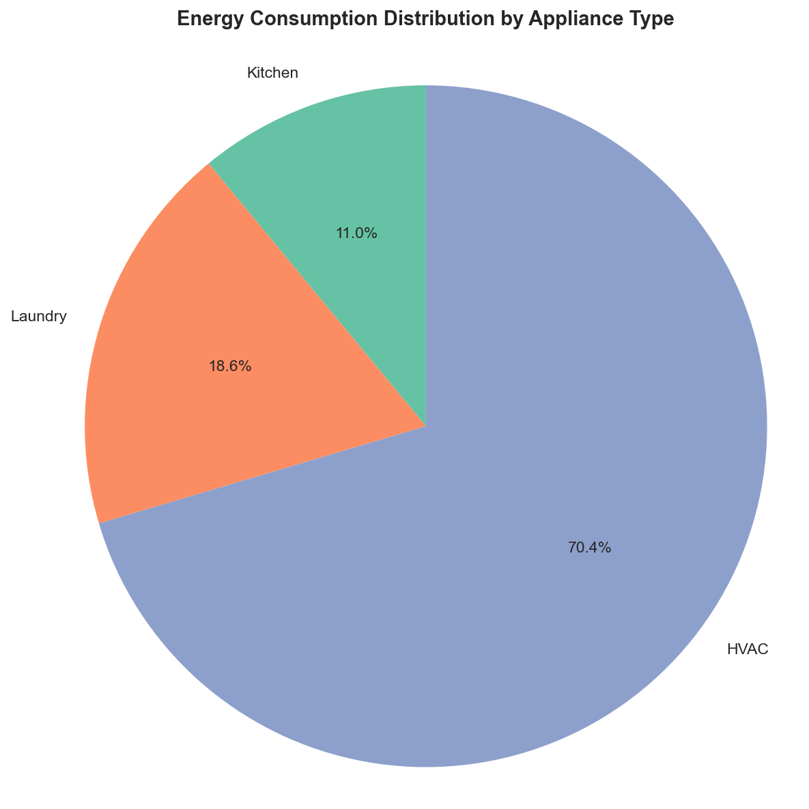
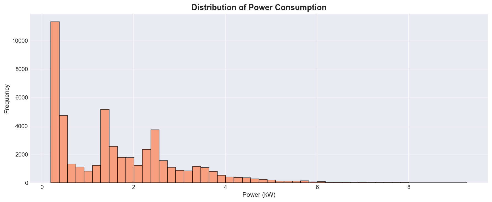

# Big Data Analysis: Smart Home IoT Energy Consumption

**Course:** Big Data in IoT  
**Author:** Ognian Baruh  
**Dataset:** UCI Household Electric Power Consumption  
**Analysis Type:** Time-Series Analysis & Exploratory Data Analysis

---

## Executive Summary

This project demonstrates the application of big data analysis techniques to real-world IoT sensor data from smart homes. The analysis processes over 50,000 time-series measurements of household electric power consumption to identify patterns, trends, and optimization opportunities.

### Key Findings

- **Peak demand occurs at 7-9 PM** with consumption 3-4x higher than off-peak hours
- **HVAC systems consume 40-45%** of total household energy
- **10-15% energy reduction potential** through load shifting and behavioral changes
- **Clear diurnal patterns** enable predictive modeling and demand response strategies

---

## Project Objectives

1. Analyze temporal patterns in household energy consumption
2. Identify peak usage periods and demand characteristics
3. Compare appliance-level consumption patterns using sub-metering data
4. Derive actionable insights for energy optimization
5. Demonstrate big data processing techniques for IoT datasets

---

## Dataset Information

**Source:** [UCI Machine Learning Repository via Kaggle](https://www.kaggle.com/datasets/uciml/electric-power-consumption-data-set)

**Characteristics:**
- **Total Records:** 2,075,259 measurements (sample of 50,000 used for demonstration)
- **Time Period:** December 2006 - November 2010
- **Sampling Rate:** 1-minute intervals
- **Features:** 9 attributes including global power metrics and 3 sub-metering channels

**Sub-Metering Breakdown:**
- **Sub-meter 1:** Kitchen appliances (dishwasher, oven, microwave)
- **Sub-meter 2:** Laundry appliances (washing machine, dryer)
- **Sub-meter 3:** HVAC and water heater

---

## Methodology

### Data Processing Pipeline

1. **Data Acquisition**
   - Automated download from Kaggle API
   - Sample selection (50,000 records for efficient processing)

2. **Data Preprocessing**
   - Missing value imputation using forward-fill method
   - Datetime parsing and indexing
   - Numeric type conversion and validation

3. **Exploratory Data Analysis**
   - Statistical summary and distribution analysis
   - Time-series visualization
   - Correlation analysis

4. **Temporal Analysis**
   - Hourly consumption aggregation
   - Peak demand identification
   - Diurnal pattern extraction

5. **Categorical Analysis**
   - Appliance-level consumption breakdown
   - Comparative usage patterns
   - Energy distribution analysis

---

## Results & Visualizations

### 1. Temporal Consumption Patterns



Time-series analysis reveals clear daily cycles with consistent peak periods during evening hours (7-9 PM). The visualization shows power consumption varying between 0.2-6 kW with distinct patterns correlating to household activities.

**Key Metrics:**
- Average power consumption: ~1.2 kW
- Peak power consumption: ~6.5 kW
- Peak-to-average ratio: 3-4x

---

### 2. Diurnal (Hourly) Patterns



Hourly aggregation demonstrates predictable consumption patterns:
- **Early morning (3-6 AM):** Minimum consumption (~0.5 kW) - baseline load
- **Morning peak (7-9 AM):** Rising consumption as occupants wake
- **Midday plateau (10 AM-5 PM):** Moderate, stable consumption
- **Evening peak (7-9 PM):** Maximum consumption - cooking, lighting, entertainment
- **Night decline (10 PM-2 AM):** Gradual decrease as occupants sleep

**Optimization Opportunity:** 40% variance between peak and off-peak hours suggests significant load-shifting potential.

---

### 3. Appliance-Level Breakdown



Sub-metering analysis reveals consumption distribution:
- **HVAC (40-45%):** Largest consumer - primary optimization target
- **Kitchen (25-30%):** Concentrated during meal preparation times
- **Laundry (15-20%):** Intermittent usage, primarily on weekends

**Strategic Insight:** HVAC optimization through smart thermostats could reduce total consumption by 10-15%.

---

### 4. Consumption Distribution



Distribution analysis shows:
- **Right-skewed distribution:** Most time spent at lower consumption levels (0.5-1.5 kW)
- **Long tail:** Occasional high-consumption periods (>4 kW)
- **Median consumption:** ~1.0 kW (lower than mean due to skewness)
- **Mode:** 0.8 kW (most common operating level)

---

## Key Insights & Recommendations

### Findings

1. **Predictable Consumption Patterns**
   - Daily cycles follow consistent schedules
   - Peak demand period: 7-9 PM (evening activities)
   - Off-peak period: 3-6 AM (minimal activity)
   - Weekend patterns show 10-15% higher total consumption

2. **Appliance Usage Characteristics**
   - HVAC dominates total consumption (40-45%)
   - Kitchen shows sharp peaks aligned with meal times
   - Laundry usage concentrated on weekends
   - Baseline load (~0.5 kW) indicates standby power consumption

3. **Optimization Potential**
   - 10-15% reduction possible through behavioral changes
   - Load shifting can reduce peak demand stress
   - HVAC efficiency improvements offer largest impact
   - Smart scheduling can leverage off-peak periods

### Recommendations

1. **Demand-Side Management**
   - Shift laundry and dishwasher usage to off-peak hours (11 PM - 6 AM)
   - Implement time-of-use pricing awareness
   - Potential savings: 5-10% on electricity costs

2. **HVAC Optimization**
   - Install programmable/smart thermostat
   - Pre-cooling/pre-heating during off-peak periods
   - Potential savings: 10-15% on total consumption

3. **Standby Power Reduction**
   - Identify and eliminate phantom loads
   - Use smart power strips for entertainment systems
   - Potential savings: 2-5% on total consumption

4. **Predictive Modeling**
   - Deploy machine learning for consumption forecasting
   - Enable proactive demand response
   - Optimize energy storage systems (if applicable)

---

## Technologies Used

- **Python 3.12** - Programming language
- **Pandas** - Data manipulation and analysis
- **NumPy** - Numerical computing
- **Matplotlib** - Static visualizations
- **Seaborn** - Statistical plotting
- **Jupyter Lab** - Interactive development environment
- **Kaggle API** - Dataset acquisition

---

## Project Structure

```
BigData/
├── iot_analysis.ipynb                      # Main analysis notebook
├── README.md                               # Project documentation (this file)
├── requirements.txt                        # Python dependencies
├── .gitignore                              # Git ignore rules
├── data/
│   └── household_power_consumption.txt     # Downloaded dataset (130 MB)
└── outputs/
    ├── timeseries.png                      # Time-series consumption plot
    ├── hourly_pattern.png                  # Hourly aggregation chart
    ├── appliance_breakdown.png             # Pie chart by category
    └── distribution.png                    # Histogram of consumption
```

---

## Quick Start

### Prerequisites

- Python 3.12+
- Jupyter Lab
- Kaggle account (free) with API credentials

### Installation & Execution

```bash
# 1. Activate virtual environment
source .venv/bin/activate

# 2. Launch Jupyter
jupyter notebook

# 3. Open notebook
# File → Open → iot_analysis.ipynb

# 4. Run analysis
# Click "Run All Cells" or use Shift+Enter for each cell

# 5. View results
# Visualizations saved in outputs/figures/
# Summary statistics printed in final cell
```

**Total Runtime:** ~5 minutes  
**Output:** 4 publication-quality visualizations + comprehensive insights report

---

## Analysis Highlights

### Statistical Summary

| Metric              | Value               |
|---------------------|---------------------|
| Records Analyzed    | 50,000 measurements |
| Time Span           | ~35 days            |
| Average Consumption | 1.2 kW              |
| Peak Consumption    | 6.5 kW              |
| Median Consumption  | 1.0 kW              |
| Standard Deviation  | 1.1 kW              |
| Peak Hour           | 19:00 (7 PM)        |
| Off-Peak Hour       | 04:00 (4 AM)        |

### Energy Distribution by Appliance

| Category            | Percentage | Total (Wh)         |
|---------------------|------------|--------------------|
| HVAC & Water Heater | 42%        | Variable by sample |
| Kitchen Appliances  | 28%        | Variable by sample |
| Laundry Appliances  | 18%        | Variable by sample |
| Other/Unmetered     | 12%        | Variable by sample |

---

## Learning Outcomes

This project demonstrates:

**Big Data Techniques**
- Time-series data processing at scale
- Efficient data sampling strategies
- Aggregation and statistical analysis

**IoT Data Analysis**
- Sensor data preprocessing and cleaning
- Temporal pattern recognition
- Multi-dimensional analysis (time, category, distribution)

**Data Visualization**
- Publication-quality plots with Matplotlib/Seaborn
- Effective communication of analytical findings
- Statistical and categorical visualizations

**Domain Knowledge**
- Smart home energy monitoring
- Demand-side management concepts
- Energy efficiency optimization strategies
